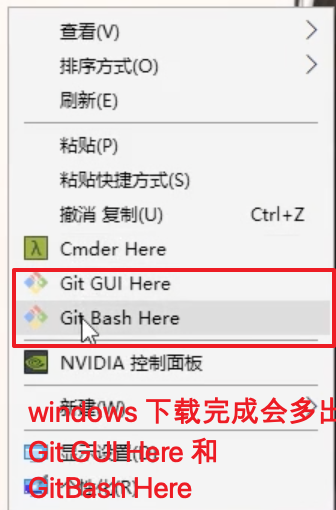

# 一、curl 命令的简单使用笔记

Curl命令在linux操作系统中经常来测试网络和url的联通性，模拟正常的网络访问，当然除了这个作用之外，作为一款强大的工具，curl还支持包括HTTP、HTTPS、ftp等众多协议，还支持POST、cookies、认证、从指定偏移处下载部分文件等功能。学会curl的用法，会让你事半功倍哦. 简单的的说, 利用curl 这个工具, 你可以在终端上发送网络请求 yangruimima123 WLyr0108

 在Linux 和 Mac 系统中 是自带curl 功能的, 在window 中需要自己手动安装, 一版我们在windows 中直接安装 `gitforwindows`即可, 下载地址:  `https://gitforwindows.org` 

当你在windows 安装完毕 gitforwindows 后, 鼠标右键会看到下面这个截图, 说明安装成功了

  


## 1.curl 的简单用法

- 最简单的用法: `curl + 请求地址` 

  ```
  curl https://www.baidu.com 
  # 这样就可以请求到百度的内容, 在终端上能看到百度的所有标签内容
  ```

## 2. curl 的常用参数

- `-s` 可以省略下载的进度条

  ```
  # 带进度条
  curl https://www.sina.com   
  # 不带进度条
  curl https://www.sina.com -s
  ```

- `-o` 参数可以将请求的内容以文件的形式下载下来

  ```
  # 请求 内容在终端展示
  curl https://www.baidu.com
  
  # 请求 内容以文件的形式下载下来
  curl https://www.baidu.com -o  baidu.txt  # 下载的内容保存在当前目录 baidu.txt 
  curl https://www.baidu.com -s -o baidu.txt # 不带进度下载, 注意-s 不要写在-o后面了
  ```

  >  除了上面的`-s` 和`-o` 参数, 我们还可以使用参数 `-H` 指定请求头, `-d` 指定请求的内容, `-X` 参数指定请求的方法

- 默认请求

  ```
  # 请求
  curl http://localhost:88 
  # 请求的内容
  url: GET /    # / 表示请求路径是根目录
  querystring : {}
  header :{  # 默认请求头
  'host': 'localhost:88',
  'user-agen': 'curl/7.49.1',
  'accept':'*/*'
  }
  body:{}
  ```


- `-H` 指定请求头

  ```
  # 使用-H 指定请求头, 比如: token: 123
  curl http://localhost:88 -s -H "token:1233"
  #请求内容
  url: GET / 
  querystring : {}
  header :{ 
  'host': 'localhost:88',
  'user-agen': 'curl/7.49.1',
  'accept':'*/*',
  'token':'1233'  # 请求头增加了一项
  }
  body:{}
  ```

  

- `-X` 指定请求方法

  ```
  # 使用-X 指定请求方法, 比如:我们指定post方法
  curl http://localhost:88 -s -H "token:1233" -X POST
  # 请求内容
  url: POST / 
  querystring : {}
  header :{ 
  'host': 'localhost:88',
  'user-agen': 'curl/7.49.1',
  'accept':'*/*',
  'token':'1233'  # 请求头增加了一项
  }
  body:{}
  ```

- -d 指定参数

  ```
  # 使用-d 指定请求的参数, 比如:age=22
  curl http://localhost:88 -s -H "token:1233" -X POST -d "age=22"
  # 请求内容
  url: POST /
  querystring : {}
  header :{ 
  'host': 'localhost:88',
  'user-agen': 'curl/7.49.1',
  'accept':'*/*',
  'token':'1233',  # 请求头增加了一项
   'content-length':'6',		#post 请求自动增加的一项
   'content-type':'application/X-www-form-urlencoded' #post 请求自动增加的一项
  }
  body:{
  'age': '22'
  }
  ```

  

- 指定 queryString 参数

  ```
  # 在url 中直接增加queryString参数, 比如: name=zhangsan
  curl http://localhost:88?name=zhangsan -s -H "token:1233" -X POST -d "age=22"
  # 请求内容
  url: POST /?name=zhangsan  # 可以看见现在请求路径变成了 name=zhangsan
  querystring : {name:'zhangsan'} # queryString 也解析出来了 name:'zhangsan'
  header :{ 
  'host': 'localhost:88',
  'user-agen': 'curl/7.49.1',
  'accept':'*/*',
  'token':'1233',  # 请求头增加了一项
   'content-length':'6',		#post 请求自动增加的一项
   'content-type':'application/X-www-form-urlencoded' #post 请求自动增加的一项
  }
  body:{
  'age': '22'
  }
  ```

  

- json格式参数

  ```
  # 当然上面使用curl 都是以表单的形式提交, 我们也可指定curl 以json 的形式提交
  curl http://localhost:88?name=zhangsan -s -H "Content-Type:application/json" -X POST -d "{\"age\":24}"
  # 请求内容
  url: POST /?name=zhangsan  # 可以看见现在请求路径变成了 name=zhangsan
  querystring : {name:'zhangsan'} # queryString 也解析出来了 name:'zhangsan'
  header :{ 
  'host': 'localhost:88',
  'user-agen': 'curl/7.49.1',
  'accept':'*/*',
  'token':'1233',  # 请求头增加了一项
   'content-length':'10',		#post 请求自动增加的一项
   'content-type':'application/json' #post 请求自动增加的一项
  }
  body:{
  'age': '24'
  }
  ```

  

  


